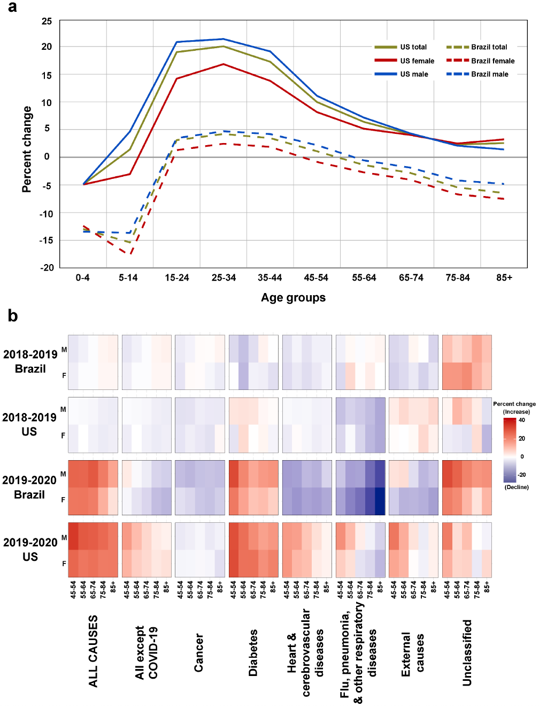

# COVID-19 is not an Independent Cause of Death

Here we provide the data and pipeline for: [COVID-19 is not an Independent Cause of Death](https://doi.org/10.1215/00703370-10575276)

### Citation

Marcia C Castro, Susie Gurzenda, Cassio M Turra, Sun Kim, Theresa Andrasfay, Noreen Goldman. COVID-19 is not an Independent Cause of Death. *Demography* 2023; 10575276. doi: [https://doi.org/10.1215/00703370-10575276](https://doi.org/10.1215/00703370-10575276)

## Abstract

The COVID-19 pandemic has had overwhelming global impacts with deleterious social, economic, and health consequences. To assess the COVID-19 death toll, researchers have estimated declines in 2020 life expectancy at birth (*e0*). When data are available only for COVID-19 deaths, but not for deaths from other causes, the risks of dying from COVID-19 are typically assumed to be independent of those from other causes. In this research note, we explore the soundness of this assumption using data from the United States and Brazil, the countries with the largest number of reported COVID-19 deaths. We use three methods: one estimates the difference between 2019 and 2020 life tables and therefore does not require the assumption of independence, and the other two assume independence to simulate scenarios in which COVID-19 mortality is added to 2019 death rates or is eliminated from 2020 rates. Our results reveal that COVID-19 is not independent of other causes of death. The assumption of independence can lead to either an overestimate (Brazil) or an underestimate (United States) of the decline in *e0*, depending on how the number of other reported causes of death changed in 2020.

__Fig 1__ Percent change in age-specific death rates in the United States and Brazil, by sex. 
Panel a: between 2019 and 2020 for all non-COVID-19 causes combined. 
Panel b: heat map of the percentage change between 2018-2019 and 2019-2020, for major categories of cause of death, ages 45+.

## Organization
For additional information see the `README.md` files in each folder: 
- `data` — Excel files for calculations for change in life expectancy associated with COVID-19, including data used as inputs for the life expectancy calculations  
- `figures` - All figure and Appendix figure from the publication

## Correspondence
For any issues with anonymization or major issues with the functionality of the script please [create an issue](https://github.com/mcastrolab/Covid-19_competing_risk/issues).

### License
The data collected and presented is licensed under the [Creative Commons Attribution 4.0 license](https://creativecommons.org/licenses/by/4.0/), and the underlying code used to format, analyze and display that content is licensed under the [MIT license](http://opensource.org/licenses/mit-license.php). 

# Authors

- __Marcia C Castro__: Department of Global Health and Population, Harvard TH Chan School of Public Health | : [\@marciacastrorj](https://twitter.com/marciacastrorj)
- __Susie Gurzenda__: The Cecil G. Sheps Center for Health Services Research, The University of North Carolina at Chapel Hill | : [\@susiegurzenda](https://twitter.com/susiegurzenda)
- __Cassio M Turra__: Demography Department, Cedeplar, Universidade Federal de Minas Gerais | : [\@CassioMTurra](https://twitter.com/CassioMTurra)
- __Sun Kim__: Department of Global Health and Population, Harvard TH Chan School of Public Health | : [\@SunKim0710](https://twitter.com/SunKim0710) 
- __Theresa Andrasfay__: Leonard Davis School of Gerontology, University of Southern California
- __Noreen Goldman__: Office of Population Research and Princeton School of Public and International Affairs, Princeton University
